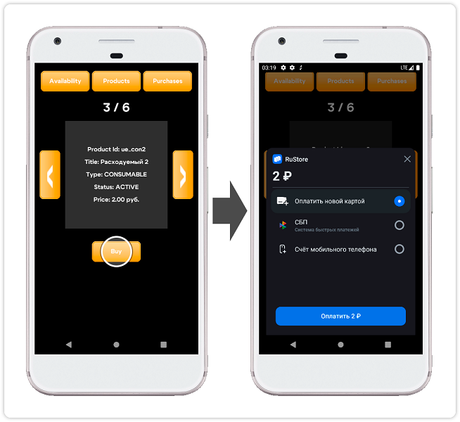

<!-- ── Language switch (EN active) ──────────────────────────────────── -->

  
    [RU][ru]
  
    EN
  

<!-- ────────────────────────────────────────────────────────────────── -->

> ⚠️ Do not use the "Code → Download" button on the GitFlic website – this method does not download files from Git LFS. [Cloning instructions](../README_CLONE.en.md).

## RuStore Defold plugin for accepting payments through third-party applications

### [🔗 Developer documentation][10]

- [SDK operating conditions](#SDK-operating-conditions)
- [Preparing required parameters](#Preparing-required-parameters)
- [Setting up the sample application](#Setting-up-the-sample-application)
- [Usage scenario](#Usage-scenario)
- [Distribution conditions](#Distribution-conditions)
- [Technical support](#Technical-support)

### SDK operating conditions

To use the SDK for ratings and reviews, the following conditions must be met:

1. The RuStore application is installed on the user's device.

2. The user is logged into the RuStore application.

3. The user and the application must not be blocked in RuStore.

4. The application must have purchases enabled in the [RuStore Console](https://console.rustore.ru/).

> ⚠️ The service has restrictions on operation outside of Russia.

### Preparing required parameters

1. `applicationId` — a unique identifier of the application in the Android system in reverse domain name format (example: ru.rustore.sdk.example).

2. `*.keystore` — the key file used for [signing and authenticating Android applications](https://www.rustore.ru/help/developers/publishing-and-verifying-apps/app-publication/apk-signature/).

3. `consoleApplicationId` — the application ID from the RuStore developer console (example: https://console.rustore.ru/apps/123456, `consoleApplicationId` = 123456). Detailed information about publishing applications in RuStore is available on the [help page](https://help.rustore.ru/rustore/for_developers/publishing_and_verifying_apps).

4. `productIds` — [subscriptions](https://www.rustore.ru/help/developers/monetization/create-app-subscription/) and [one-time purchases](https://www.rustore.ru/help/developers/monetization/create-paid-product-in-application/) available in your application.

### Setting up the sample application

1. Open the project _“game.project”_ in the _“billing_example”_ folder.

2. In the file _“billing_example / main / main.script”_, set the value of the "APPLICATION_ID" parameter to `consoleApplicationId` — the application code from the RuStore developer console.

3. In the _“game.project”_ file, under "Android", specify the value of `applicationId` in the "Package" field.

4. In the _“billing_example / main / main.script”_ file, list the [subscriptions](https://www.rustore.ru/help/developers/monetization/create-app-subscription/) and [one-time purchases](https://www.rustore.ru/help/developers/monetization/create-paid-product-in-application/) available in your application in the "PRODUCT_IDS" parameter.

5. In the "Bundle Application" menu (Project → Bundle → Android Application...), set the values for the fields "Keystore", "Keystore Password", "Key Password", specifying the location and parameters of the previously prepared `*.keystore` file.

6. Build the project using the “Create Bundle...” command (Project → Bundle → Android Application... → Create Bundle...) and test the application.

### Usage scenario

#### Checking payment availability

#### Retrieving the product list

Tapping the `Products` button retrieves and displays the [list of products][20].

#### Purchasing a product

Tapping the `Buy` button initiates the [product purchase][30] flow with the payment method selection overlay.

### Distribution conditions

This software, including source codes, binary libraries, and other files, is distributed under the MIT license. Licensing information is available in the [MIT-LICENSE](../MIT-LICENSE.txt) document.

### Technical support

Additional help and instructions are available on the [rustore.ru/help/](https://www.rustore.ru/help/en/) page and by email at [support@rustore.ru](mailto:support@rustore.ru).

[10]: https://www.rustore.ru/help/en/sdk/payments/defold/10-3-1
[20]: https://www.rustore.ru/help/en/sdk/payments/defold/10-3-1#retrieving-the-product-list
[30]: https://www.rustore.ru/help/en/sdk/payments/defold/10-3-1#purchasing-a-product

[ru]: README.md
[en]: README.en.md
